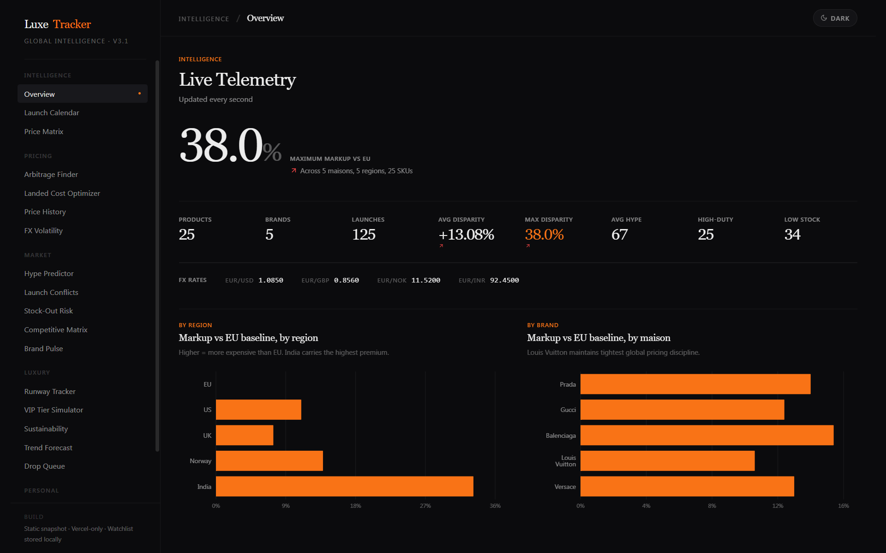
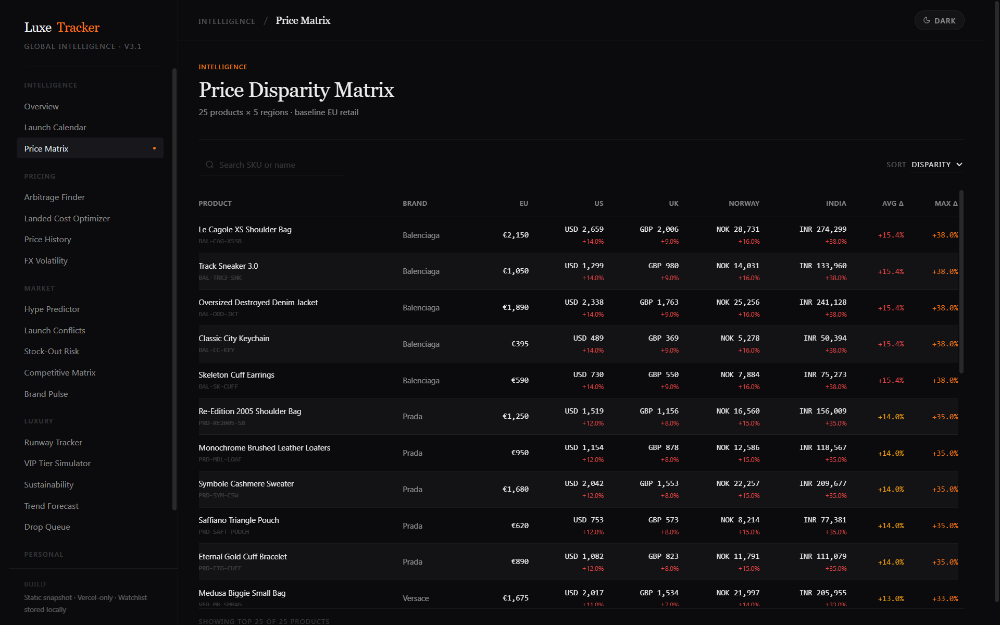
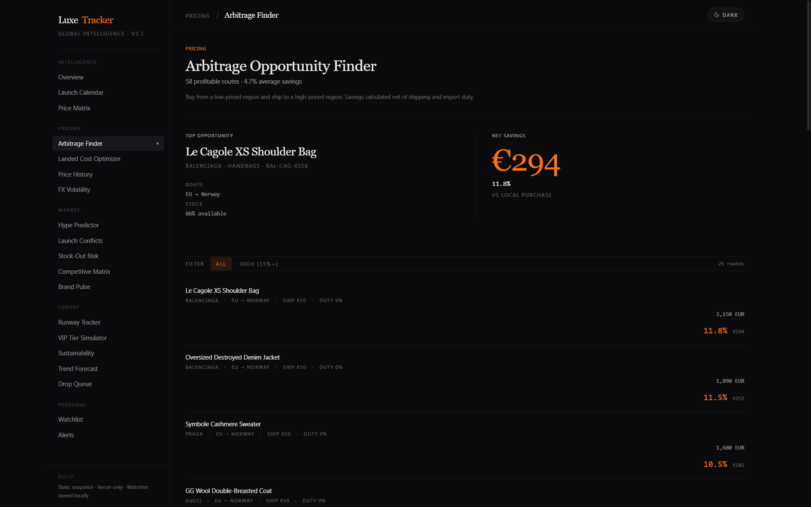
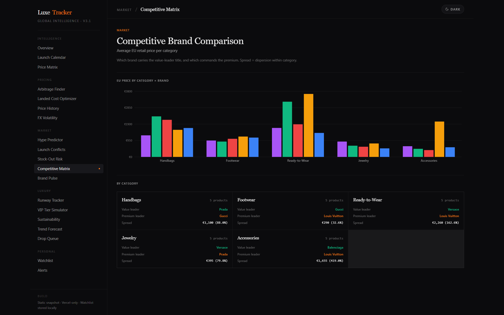
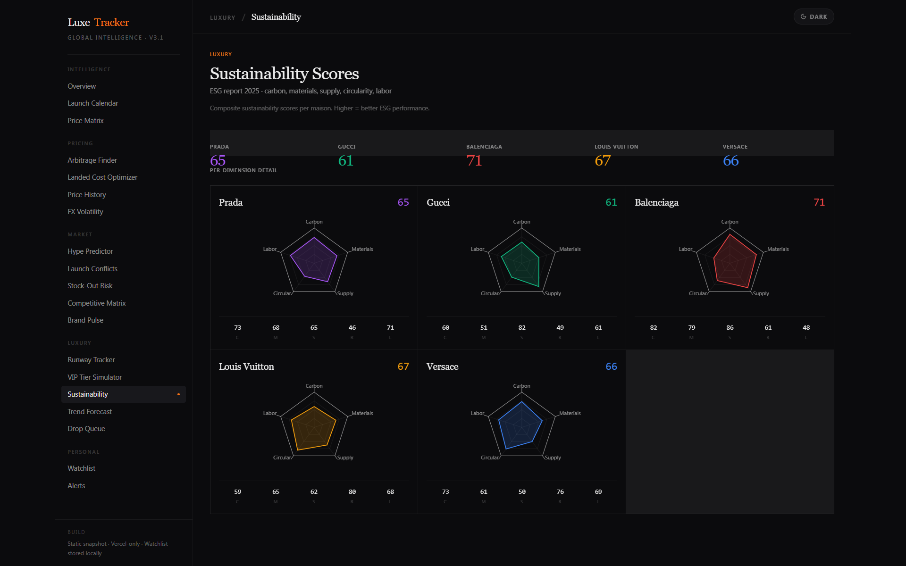

# Luxe Tracker

High-fashion global launch & price disparity tracker for Prada, Gucci, Balenciaga, Louis Vuitton and Versace. 17 intelligence panels across 5 regions with arbitrage detection, FX hedge calculator, landed-cost optimizer and brand pulse.


## Live Demo

**https://luxe-disparity-tracker.vercel.app/**

Pure client-side deterministic snapshot (seeded PRNG). Zero environment variables, always green. Data shape matches a full Prisma + Supabase backend but runs entirely in the browser.

## Screenshots

### Overview — Live Telemetry


### Price Disparity Matrix


### Arbitrage Opportunity Finder


### Competitive Brand Comparison


### Sustainability Scores


## Features

- **Live Telemetry Overview** — editorial hero number, 8-column KPI strip, FX rates, region & brand markup charts
- **Price Disparity Matrix** — sortable 5-region matrix with EUR baseline, duties, taxes and landed cost
- **Launch Calendar** — 90-day rolling grid of regional drops with status badges
- **Arbitrage Opportunity Detector** — net profit after duties, taxes and shipping per region pair
- **Landed-Cost Optimizer** — cheapest buying region recommendation per SKU
- **Price History & Anomaly Flags** — 90-day time series with >3 % daily move detection
- **FX Volatility Hedge Calculator** — 90-day FX history + what-if revaluation
- **Brand Pulse Radar** — 5-dimensional prestige / hype / scarcity / FX risk / resale score
- **Stock-Out Risk Index** — sell-out probability from inventory × hype × days-to-launch
- **Competitive Matrix, Runway Tracker, VIP Tier Simulator, Sustainability, Trend Forecast, Drop Queue, Watchlist & Alerts**

## Tech Stack

| Layer | Choice |
|-------|--------|
| Framework | Next.js 15 (App Router) |
| Language | TypeScript 5 |
| Styling | Tailwind CSS 4 (CSS-first `@theme`) |
| Charts | Recharts 2 |
| Icons | Lucide React |
| Theme | Custom dark / light with zero-FOUC bootstrap |
| Data | Deterministic in-browser snapshot (mulberry32 PRNG) |

## Quick Start

```bash
git clone https://github.com/devtechedge/luxe-tracker.git
cd luxe-tracker
bun install          # or: npm install
bun run dev          # → http://localhost:3000
```

No environment variables required.

## Architecture

Single Vercel deployment. All analytics are pure functions over a seeded in-memory snapshot (`src/lib/data-snapshot.ts` + `src/lib/analytics.ts`). Watchlist and alerts persist in `localStorage`. Dark/light theme is controlled by a no-flash inline script + CSS variables.

The same data shape was previously backed by Prisma + Supabase; the client-side version keeps the full panel surface while guaranteeing a permanent green live demo.

## License

MIT License. See [LICENSE](./LICENSE) for details.

---

Brand names and prices are synthetic and used for demonstration only. Trademarks belong to their respective owners.
